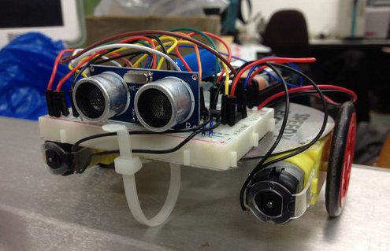

# Quickshonk (or Speedyshonk)

*[Video](https://secure.flickr.com/photos/nicecupoftea/19958858401/) of quickshonk bumbling about*

A slight variation on the [normal shonkbot](https://github.com/jarkman/shonkbot);
this one is:

 * Somewhat faster
 * Somewhat less accurate, so...
 * Probably not as well suited to drawing things
 * Hopefully just as cheap
 * Certainly less well documented
 * Not properly integrated with shonkbot (code written for one won't work on
   the other)

The purpose was:

 * see if a faster one can stay within the budget (it broadly does, I think,
   and ultrasonic is an indulgence really)
 * give interested people variations to build after shonkbot

Since quickshonk is a [philistine](https://en.wikipedia.org/wiki/Philistinism)
and doesn't bother drawing, releasing it in a pen of shonkbots that are blind
(got to the test-whether-it-draws stage but not yet to the IR proximity detector
stage) or just busy drawing can stir things up a bit.  That could be considered
a good or a bad thing depending on how you look at it.

# Parts/changes

 * AccelStepper is not used.
 * [Ultrasonic-HC-SR04](https://github.com/JRodrigoTech/Ultrasonic-HC-SR04) is
needed.
 * No stepper motors, no stepper motor drivers, (currently) no LEDs
 * An SN754410 or L293D ([£0.32](http://www.ebay.co.uk/itm/141663342419) to [£1.80](http://www.hobbytronics.co.uk/h-bridge-driver-sn754410) depending on how many/delivery speed)
 * 2 x [TT gearhead motor](http://www.ebay.co.uk/itm/391083333774) (~£2)
 * An [HC-SR04 ultrasonic rangefinder](http://www.ebay.co.uk/itm/301559167417) (~£1)

# Wiring

Those gearhead motors don't come with wires, so some kind of soldering,
friction/clamping or wrapping of wires around the tabs is needed.

See the Fritzing diagram ([image](doc/quickshonk_bb.png?raw=true) or
[PDF](doc/quickshonk_bb.pdf)) for general wiring.  There's
no step-by-step like shonkbot has; sorry.

# Behaviour

Quickshonk currently just wanders about avoiding bumping into walls, and tries
a couple of manoeuvres to escape if he thinks he's stuck.  If he decides none
of them are working, he gives up, stops and sulks/cries until power-cycled.

# Improvements

 * Right now quickshonk often stops and thinks quite hard, probably owing to a
   bug in the code that averages many readings when they seem to be varying
   wildly.  He has particular problems with approaching surfaces at 45&deg; to
   his direction of motion.  Both might be improved upon by:
    * using [a better ultrasonic library](https://code.google.com/p/arduino-new-ping/)
      (this would also solve licence incompatibility with the existing library)
    * a capacitor close to the module to suppress noise
    * switching to IR for proximity (which might also let quickshonk swarm
      with shonkbot)
 * Couldn't be too hard to adapt quickshonk's higher-level calls to match
   shonkbot's.
 * On the only bot built, the left/right motor speeds vary considerably (maybe
   hot glue got in one gearhead?) and existing calibration for that is either
   broken or insufficient.  This leaves quickshonk with a strong pull to the
   left.

# Licence/Credit

Code: [GPLv3](https://www.gnu.org/licenses/gpl-3.0.txt)

Image: [Libby Miller](https://secure.flickr.com/photos/nicecupoftea/19372033234/in/photostream/), [CC-BY-NC-SA](https://creativecommons.org/licenses/by-nc-sa/2.0/)
